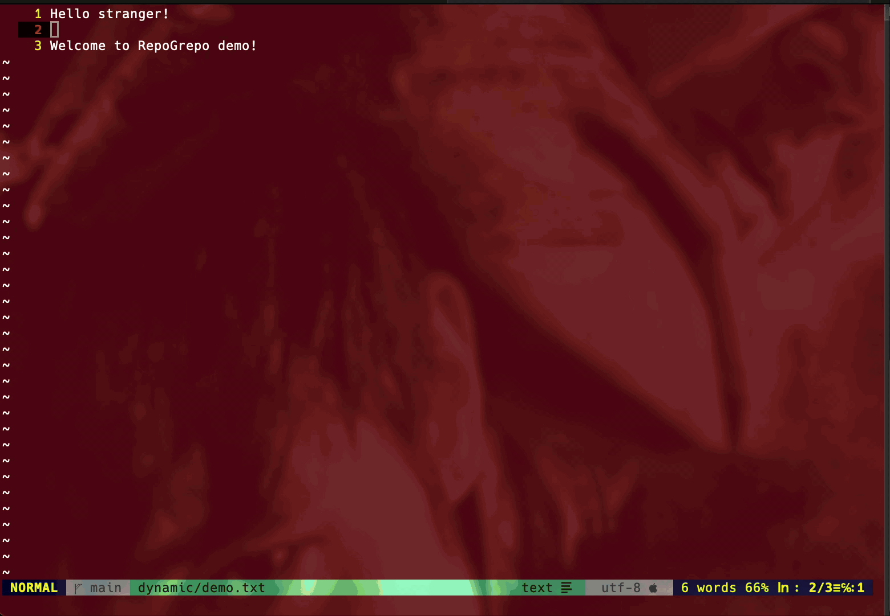

# repo-grepo.nvim

A repository-wide grep plugin for Neovim with a multi-window interface.

<p align="center">
  <a href="assets/demo.gif">
    
  </a>
</p>

> **Note**: This is a hobby project designed for small to medium-sized repositories. The plugin uses terminal colors for display and may be resource-intensive on large repositories with many files. No caching or optimizations are applied - each search scans files fresh.

> **⚠️ Early Development**: This plugin is not extensively tested yet. If you encounter bugs or unexpected behavior, please [report them](https://github.com/Morass/repo-grepo.nvim/issues) so they can be fixed!

## Features

- **C++ Backend**: File traversal and regex matching using C++
- **Multi-Window Interface**: Overlay UI with separate input windows
- **Git-Aware**: Automatically finds repository root
- **Smart Filtering**: Include/exclude files with glob patterns
- **Interactive Navigation**: Browse matches by file, then by line
- **Jump to Context**: Open files directly at matching lines

## Requirements

- Neovim 0.5+
- C++17 compatible compiler (g++, clang++)
- Git repository
- Terminal with 256 color support

## Installation

### Using vim-plug

```vim
Plug 'Morass/repo-grepo.nvim', { 'do': 'make' }
```

### Using packer.nvim

```lua
use {
  'Morass/repo-grepo.nvim',
  run = 'make'
}
```

### Manual Installation

```bash
cd ~/.vim/plugged  # or your plugin directory
git clone https://github.com/Morass/repo-grepo.nvim.git
cd repo-grepo.nvim
make
```

## Usage

Run the command:
```vim
:RepoGrepo
```

### Interface

The plugin opens with three input windows:

1. **Search Pattern**: Enter your regex pattern (required)
2. **Include Files**: Comma-separated regexes to filter files (optional, empty = all files)
3. **Banned Files/Folders**: Comma-separated glob patterns to exclude files/folders (default excludes common Python/Git cache and temp files)

### Shortcuts

#### Input Screen
- `Enter` - Start search
- `Up`/`Down` arrows - Switch between input windows (circular)
- `Ctrl+n` - Alternative to Down arrow
- `Esc` or `q` - Close plugin

#### File List Screen
- `Enter` - View matching lines in selected file
- `Esc` or `q` - Back to search input

#### Line List Screen
- `Enter` - Open file at selected line
- `Esc` or `q` - Back to file list

## Configuration

Set default values in your `init.vim` or `init.lua`:

```vim
" Default banned files/folders (comma-separated glob patterns)
let g:repo_grepo_banned_files = '*venv*,__pycache__,.git,node_modules,.mypy_cache,.pytest_cache,.tox'

" Default include files (comma-separated glob patterns, empty = all)
let g:repo_grepo_include_files = ''
```

Or in Lua:

```lua
vim.g.repo_grepo_banned_files = '*venv*,__pycache__,.git,node_modules,.mypy_cache,.pytest_cache,.tox'
vim.g.repo_grepo_include_files = ''
```

## How It Works

1. **Input Phase**: Enter search criteria in multi-window overlay
2. **Search Phase**: C++ binary scans repository recursively
3. **File List**: Results sorted by match count, then alphabetically
4. **Line List**: Shows all matching lines with line numbers
5. **Jump**: Opens file at exact line in your editor

## Performance Notes

The C++ backend uses:
- Multi-threaded parallel processing with a 20-thread pool
- Parallel directory discovery for fast repository traversal
- Regex compilation with `std::regex::optimize`
- Filesystem traversal with `std::filesystem`
- Binary file detection to skip non-text files
- Pattern-based filtering to reduce files scanned
- Thread-local batching to minimize synchronization overhead

The search engine is optimized for both flat and deeply nested directory structures, utilizing parallel processing throughout the entire pipeline.

## License

MIT
